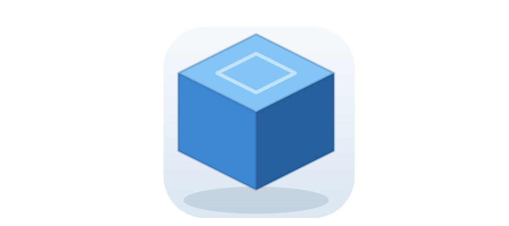
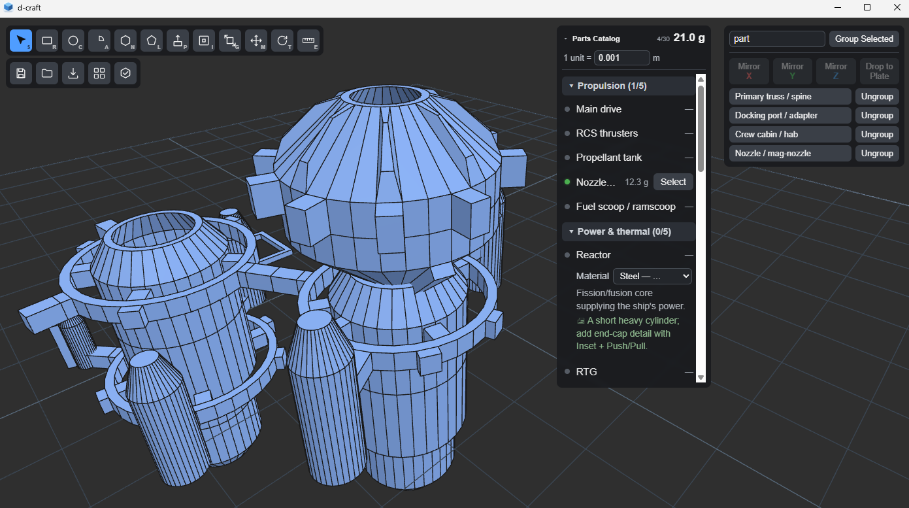

# 3D-craft (AKA D-Craft)

A lightweight native Windows CAD tool for modeling small parts to 3D print, inspired by
SketchUp's workflow. Built with Rust + Tauri v2 + three.js. Sketch a face, push/pull it into a
solid, refine, and export a print-ready STL (millimeters, Z-up).





## Install

Prerequisites:

- [Rust](https://www.rust-lang.org/tools/install) (stable) with the MSVC toolchain
- [Node.js](https://nodejs.org/) 18+
- Windows with the [Tauri v2 prerequisites](https://v2.tauri.app/start/prerequisites/) (WebView2 +
  the "Desktop development with C++" build tools)

Then, from the repo root:

```sh
npm install
```

## Run

```sh
npm run tauri dev
```

This launches the full app in a native window (Vite dev server + Rust backend), with hot-reload on
frontend changes and automatic backend recompiles.

To produce a distributable build:

```sh
npm run tauri build
```

## Operation

Pick a tool from the left toolbar (or press its shortcut). Most tools work on the clicked face, or
on the whole selection if the clicked face is already selected. While dragging, **type a number**
to set an exact value (mm, or degrees for Rotate) and press **Enter** to commit; **Esc** cancels.

| Tool | Key | What it does |
| --- | --- | --- |
| Select | `S` | Click a face to select. `Ctrl+D` duplicates the selection. |
| Rectangle | `R` | Draw a rectangle on the ground or on an existing face. |
| Circle | `C` | Draw a circle. |
| Arc | `A` | Click center, click to set radius, click (or type degrees) to set the sweep. Closes with a straight chord - a 180° arc is a half-pipe cross-section. |
| N-Gon | `N` | Click center, click to set radius and rotation (one vertex lands under the cursor). Press `↑`/`↓` to change the side count (5-8, default 6) before committing. |
| Polygon | `L` | Click points to draw a closed polygon. Hold `Shift` while placing a point to lock the segment to the sketch plane's axes (90° corners). |
| Push/Pull | `P` | Drag a face along its normal to extrude a solid (or carve inward). |
| Inset | `I` | Offset a face's border inward. |
| Scale | `G` | Scale the selection about its center. |
| Move | `M` | Drag to reposition. Hold `Shift` for vertical; press `X`/`Y`/`Z` to lock to an axis. |
| Rotate | `T` | Drag to rotate. Press `X`/`Y`/`Z` to choose the spin axis (defaults to Z). |
| Measure | `E` | Click two points to read the straight-line distance plus X/Y/Z deltas. Snaps to corners/midpoints/edges, or free points on faces/ground; `Esc` cancels. Creates no geometry. |

Other controls:

- **Camera**: orbit, pan, and zoom with the mouse (SketchUp-style), Z-up.
- **Build plate**: the ground grid is a true-scale 180 × 180 mm print bed in 10 mm cells, centered
  on the origin; the brighter outline marks the printable boundary.
- **Undo / Redo**: `Ctrl+Z` / `Ctrl+Y` (or `Ctrl+Shift+Z`).
- **Outliner** (right panel): manage groups, mirror a copy of the selection across X/Y/Z, and
  **Drop to Plate** — moves every selected object independently down (or up) along Z so each one
  rests on the build plate.
- **Parts Catalog** (collapsible dropdown, top right): a guided build manifest of spacecraft subsystems (propulsion,
  reactors, crew cabins, solar sails, …) with 3D-print tips. A part's dot turns **green** once
  it's modeled — i.e. once a group of that name exists. Click a green part's **Select** to
  reselect its geometry; with a selection active, click an unmodeled part's **Tag** to mark that
  selection as the part. Click a part's name to expand its description, print tip, and material.
  Edit `src/ui/parts-catalog-data.ts` to grow or change the list.
  - **Mass estimate**: each modeled part shows an estimated mass = enclosed solid volume ×
    scale³ × material density. Pick a **material** in the part's expanded row, and set the global
    **scale** ("1 unit = _ m", default `0.001`, i.e. model drawn true-size in mm) — the header
    shows the running **total dry mass**. Volume is computed from the model geometry; hollow parts
    (thin-walled hulls, tanks) are treated as solid and so read heavy. Material and scale choices
    persist between sessions (stored locally, not in the project file).
- **File menu**: save/open a project, export STL (blocked if the model isn't a watertight,
  printable solid), **Arrange for Print** (moves every printable solid onto a floor-aligned,
  non-overlapping grid, ready to slice; flat sketches are left alone), and **Check Model**.
  - **Check Model**: reports whether every printable solid is watertight, and if not, draws the
    offending edges in **red** directly in the viewport — the rim of the hole where a face is
    missing, so you can see which part is broken instead of guessing. The red edges draw on top of
    the model, so a problem on the far side is still visible without orbiting. If an STL export is
    refused, the same information is one click away via **Show Me** in the error dialog. The
    highlight clears itself as soon as you make any edit (including Undo).
- **Closing the window**: if there are unsaved changes, closing prompts to **Save**, **Discard**,
  or **Cancel** instead of silently quitting.

## Development

- `npm run tauri dev` — run the app (primary dev loop)
- `npx tsc --noEmit` — type-check the frontend
- `cd src-tauri && cargo test` — run the Rust test suite

See [CLAUDE.md](CLAUDE.md) for architecture and contributor notes.

## License

GPLv3 — see [LICENSE](LICENSE). Anyone is free to use, modify, and redistribute this app;
modified versions that are distributed must also be released under GPLv3.

Inspired by SketchUp's modeling workflow (push/pull, orbit-style camera), but is an independent,
from-scratch implementation — no SketchUp code, assets, or branding — and isn't affiliated with or
endorsed by Trimble Inc.
